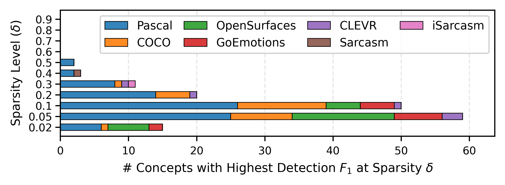
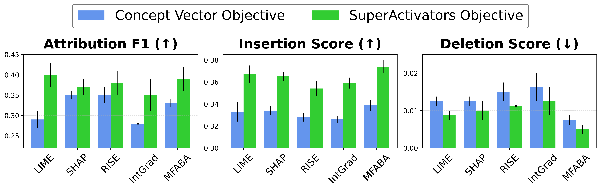

> Concept vectors are meant to be helpful interpretability tools, associating directions in a model's latent space with human-understandable concepts. However, in practice their activations are noisy and inconsistent, limiting their utility. We find a clear pattern in the noise, which we call the **SuperActivator Mechanism**: while most in-concept and out-of-concept activations overlap, only the token activations in the *extreme high tail* of the distribution provide a clear, reliable signal of concept presence. 

# Concept Vector Activations are Noisy
Modern transformer-based models, while increasingly powerful and ubiquitous, remain opaque and can behave in ways that are unpredictable or harmful. Concept vectors serve as a bridge to understanding these black boxes. By defining directions in the latent space that correspond to specific concepts, they link the model's abstract internal representations with human-understandable semantics. This provides a lightweight tool for examining and even influencing model behavior.

To analyze the presence of a concept, we typically compute *concept activation scores*—a measure of alignment between an input token’s embedding and a concept vector. However, these scores are often noisy and unreliable in practice, and as a result misrepresent true concept presence.

{% include toggle-multidataset-js.html
   id="multi-datasets"
   caption="Compare raw activations vs SuperActivator views across datasets. Auto toggles every 5s; manual clicks pause for 10s."
   auto_ms=2000
   resume_ms=5000
   default_label="COCO"

   dataset1_label="COCO"
   dataset1_raw="/assets/images/superactivators/Coco_example_nosuper.png"
   dataset1_super="/assets/images/superactivators/Coco_example.png"

   dataset2_label="OpenSurfaces"
   dataset2_raw="/assets/images/superactivators/OpenSurfaces_example_nosuper.png"
   dataset2_super="/assets/images/superactivators/OpenSurfaces_example.png"

   dataset3_label="Pascal"
   dataset3_raw="/assets/images/superactivators/Pascal_example_nosuper.png"
   dataset3_super="/assets/images/superactivators/Pascal_example.png"

   dataset4_label="iSarcasm"
   dataset4_raw="/assets/images/superactivators/iSarcasm_example_nosuper.png"
   dataset4_super="/assets/images/superactivators/iSarcasm_example.png"

   dataset5_label="GoEmotions"
   dataset5_raw="/assets/images/superactivators/GoEmotions_example_nosuper.png"
   dataset5_super="/assets/images/superactivators/GoEmotions_example.png"
%}
<figcaption style="text-align:center;">Concept activation heatmaps are ambiguous and potentially misleading, 
but highly activated SuperActivators reliably distinguish true concept presence.</figcaption>

The interactive figure above demonstrates this problem. In the COCO example, the activation heatmaps for *Animal* and *Person* appear to highlight the same region, even though only the former is present. If you viewed the *Person* heatmap in isolation, you might incorrectly conclude that a person is in the image.

The issue also affects concepts that are present. For example, many tokens corresponding to the Car region do not strongly activate for the *Car* concept vector.

Such noisy activation signals make it difficult to reliably detect or localize concepts. This raises the question:

 Do reliable concept signals even exist within these activations, and if so, where are they? 

To answer this question, we zoom out beyond a single image or text sample, and look at the activation distributions across a dataset.

# Separation Emerges in the Tail
We analyzed the activation distributions for tokens explicitly labeled as **in-concept** (*Dcin*) versus those labeled as **out-of-concept** (*Dcout*). Ideally, these two distributions would be clearly distinct, making it easy to distinguish the concept from the background. In reality, they overlap considerably.

In the figure below, we track these distributions across model layers for three concepts from the OpenSurfaces dataset.

<figcaption style="text-align:center; font-style:italic; margin-top:5px;">Activation distributions separate primarily in the extreme tail as model depth increases.</figcaption>

In early layers, the in-concept and out-of-concept distributions are nearly identical, both centered around 0. As we move deeper into the model, the distributions do begin to separate, but not via a uniform shift. Instead, the in-concept distribution (*Dcin*) develops a *heavy positive tail*. While the majority of in-concept tokens remain indistinguishable from the out-of-concept noise, this extreme high-activation tail becomes distinct. 

Crucially, we notice that this tail also exhibits **high coverage**: most image and text samples labeled as containing the concept have at least one token in this region of the distribution.

# Introducing the *SuperActivator Mechanism*
To be reliable, a concept signal needs to meet two key criteria:
- **Separation**: It must be distinguishable from background noise (out-of-concept activations).
- **Coverage**: It must consistently appear in samples where the concept is present.

We discovered that the extreme high-activation tail is the only part of the distribution that satisfies both. We call this the **SuperActivator Mechanism**.

The SuperActivator tokens are defined by a sparsity parameter, δ, which isolates the top percentile of the in-concept distribution. For example, a δ of 0.05 targets the top 5% of in-concept activations. 

We observe the SuperActivator Mechanism in diverse settings:
 - **Modalities**: image and text datasets
 - **Concept Types**: supervised (mean prototypes, linear separators) and unsupervised (k-means clusters, k-means-derived separators, SAEs)
 - **Models**: CLIP, LLaMA-3.2-Vision-Instruct, Gemma-2b-9B, and Qwen3-Embedding

No matter how the concepts are defined, and no matter which model produced the embeddings, the most reliable evidence always concentrates in the extreme tail. This consistency suggests that the SuperActivator Mechanism reflects a **general principle of how transformers encode semantics**.

## SuperActivators are Reliable Concept Indicators

We next conduct extensive experiments over modalities, concept types, and models to evaluate which activations provide the most reliable signal for detecting concepts in a given image or text sample. 

We propose a simple concept detection approach based on the SuperActivator Mechanism we discovered: concept presence is predicted if any token in the sample is a SuperActivator. Specifically, we define a SuperActivator as a token in the extreme tail of the in-concept distribution, determined by a sparsity level δ and model layer tuned per-concept on a validation set to maximize detection F₁.

We compare this against standard aggregation techniques ([CLS]-token, Mean-pooling, Last-token, Random-token) as well as zero-shot prompting with LLaMA-3.2-11B-Vision-Instruct.

Notably, our SuperActivator-based method consistently outperforms all other concept detection baselines, **improving F₁ scores by up to 14%**. The table above shows results for linear separator concepts using the LLaMA-3.2-11B-Vision-Instruct model, but we observed this same trend across all tested models and concept types. 

These results confirm that SuperActivators provide the most reliable indicators of concept presence over all baselines.

## SuperActivators are very Sparse
Rather than assuming a specific sparsity level, we treat the threshold δ as a tunable hyperparameter. By sweeping across possible values, we experimentally determine exactly how much of the distribution contains reliable concept signals.

**We found that detection performance consistently peaks when using only a small fraction of the most highly activated tokens**—typically between δ=5-10%. Thus, only a sparse subset of tokens carry the strongest and most reliable concept information. In fact, including additional activations that still correspond to the annotated concept region—but have weaker activations—only hurts performance.

We can see how this sparsity manifests at the sample level in the following figures. They show cumulative distribution functions for the LLaMA-3.2-11B-Vision-Instruct linear-separator concepts from various datasets, using each concept’s optimal model layer and sparsity level. For each in-concept sample, we plot the ratio of SuperActivators to the total number of in-concept tokens. This normalizes for varying concept sizes and allows us to see how dense the reliable signal is within the concept region.

{% include toggle-multidataset-static-js.html
     id="my-datasets"
     caption="Cumulative distribution functions showing the ratio of SuperActivators to in-concept tokens in each test sample"
     default_label="COCO"

     dataset1_label="COCO"
     dataset1_img="/assets/images/superactivators/cdfs/Coco.png"

     dataset2_label="OpenSurfaces"
     dataset2_img="/assets/images/superactivators/cdfs/Broden-OpenSurfaces.png"

     dataset3_label="Pascal"
     dataset3_img="/assets/images/superactivators/cdfs/Broden-Pascal.png"

     dataset4_label="iSarcasm"
     dataset4_img="/assets/images/superactivators/cdfs/iSarcasm.png"

     dataset5_label="GoEmotions"
     dataset5_img="/assets/images/superactivators/cdfs/GoEmotions.png"
%}
Across datasets, **the majority of in-concept samples have a ratio below 0.2—meaning fewer than one SuperActivator for every five in-concept tokens**. Overall, these plots confirm that most in-concept samples contain only a small, concentrated set of reliable concept signals relative to the total number of in-concept tokens.

## A Practical Tail-Focused Implementation
We also developed a simplified, practical variant of our detector that operationalizes sparsity directly and removes the need for token-level supervision (like expensive segmentation masks).

In this variant, we fix a small sparsity level of $δ=10\%$—a value we experimentally found robust across diverse concepts—and retain only the top-activated tokens per sample. Using only sample-level labels, we train a single threshold on these selected activations to separate in-concept from out-of-concept samples.

This fixed-δ detector nearly matches the performance of the fully tuned SuperActivator method and still outperforms all other baselines across datasets. This provides a simple, effective way to leverage the highly informative tail for concept detection without needing dense annotations.

# SuperActivators Improve Concept Localization
Beyond just detecting *if* a concept is present, we also want to know *where* it is. Feature attribution maps aim to highlight the regions most responsible for a concept’s presence. 

These are typically generated by applying standard attribution methods—such as LIME, RISE, or Grad-CAM—relative to a target objective. In conventional concept-based attribution, this objective is the global concept vector. Attribution scores reflect how much each token shifts the model toward (or away from) that single global direction. However, global concept vectors blur together many heterogeneous instances of a concept, often mixing in spurious or weak signals.

Our key modification is simple: **instead of attributing relevance to the global concept vector, we attribute relevance to the mean embedding of that sample’s local SuperActivators**—the tokens that carry the most reliable, instance-specific concept evidence.

This change produced two major benefits:

- **More Accurate Localization:** SuperActivator-based attribution maps align much more closely with ground-truth annotated regions (higher F₁)
- **Greater Faithfulness:** Adding SuperActivator-aligned tokens increases concept evidence more quickly (higher insertion scores), and removing them causes a sharper drop in confidence (lower deletion scores)

Crucially, this improvement isn't tied to any single explainer. We tested nine different attribution methods, and **every single method improved when we swapped the global vector for the SuperActivator objective**.

The figure above shows a qualitative example: while the global concept vector attribution maps highlight
diffuse or semantically irrelevant regions, the tokens that receive high SuperActivator-based attribution
scores concentrate more precisely on human-labeled concept regions.

  <h2 style="color: #ffffff; margin-top: 0; border-bottom: 1px solid rgba(255,255,255,0.3); padding-bottom: 10px; display: inline-block;">Key Takeaway</h2>
  

    When it comes to concept vectors, ignore the bulk of the activation distribution and only trust the extreme tail!
  

---

### For more details, see our [paper](https://arxiv.org/abs/2512.05038) and [code](https://github.com/BrachioLab/SuperActivators).

